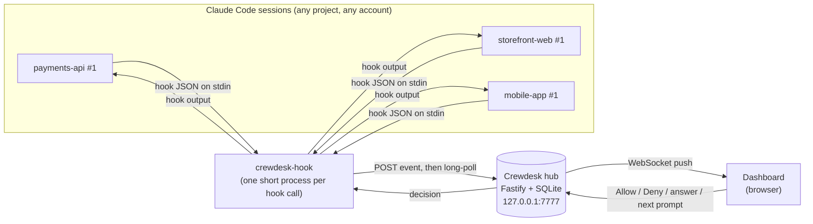
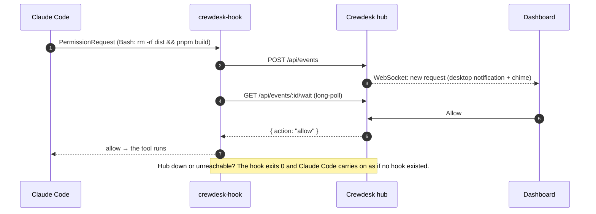

# Crewdesk

[](https://www.npmjs.com/package/crewdesk)
[](https://github.com/HusseinTaha/crewdesk/actions/workflows/ci.yml)


[](LICENSE)

One local dashboard for all your Claude Code sessions. When any session asks a question, wants permission, or finishes a turn, it shows up in one attention queue at **http://127.0.0.1:7777**. Your answer goes back to the exact session that asked. Routing uses the event id and the session id, never the name or terminal.

<picture>
  <source media="(prefers-color-scheme: light)" srcset="https://raw.githubusercontent.com/HusseinTaha/crewdesk/main/docs/images/dashboard-light.png">
  
</picture>

## Quick start

```bash
npm install -g crewdesk     # Node >= 22.13 (uses the built-in node:sqlite)
crewdesk configure          # installs hooks into ~/.claude and ~/.claude-accounts/* (with backups)
crewdesk start              # background daemon
crewdesk open               # http://127.0.0.1:7777
```

Install it globally rather than running it through `npx`. The hooks point at the installed script, so its path has to stay put. To work on Crewdesk itself, see [Development](docs/DEVELOPMENT.md).

Start Claude Code sessions normally. Sessions that were already running need a restart, or run `/hooks`, to pick up the hooks.

## How it works



Each hook call is routed by **event id → the session id stored with that event**, so an answer can only ever reach the session that asked. The terminal stays live the whole time. Whichever answers first, the dashboard or the terminal, wins.



## What reaches the dashboard

| Claude Code does… | Hook | Dashboard shows | Terminal meanwhile |
|---|---|---|---|
| Asks permission for a tool | `PermissionRequest` | **Allow / Deny** (destructive commands need a second confirm) | Dialog stays live. **First answer wins** |
| Uses `AskUserQuestion` | `PreToolUse` | Option buttons + free-text answer | Spinner. Falls back to the terminal after `questionWaitSeconds` or **Answer in terminal** |
| Finishes a turn | `Stop` | "Waiting for instructions" + **Send** next prompt | Hook waits up to `idleWaitSeconds`. **Back to terminal** releases it |
| Sends a notification | `Notification` | Dismissable notice | — |
| Starts / ends / gets a prompt | `SessionStart` / `SessionEnd` / `UserPromptSubmit` | Agent status, activity | — |

If the hub is down, every hook fails open: Claude Code behaves exactly as if no hook existed.

## Screenshots

**Permission requests.** Destructive commands are flagged and need a second confirm.


**Questions.** `AskUserQuestion` options become buttons, and you can also type a custom answer.


**Idle sessions.** When Claude finishes a turn, send the next instruction straight from the dashboard.


**Desktop notifications.** Opt in with **Notify**. They fire while the dashboard tab is in the background.


<table>
  <tr>
    <td width="50%"><b>History</b>: every event, filterable by type, status, project and agent.<br></td>
    <td width="50%"><b>Agent detail</b>: project, directory, pid, account, current task and pending requests.<br></td>
  </tr>
  <tr>
    <td width="50%"><b>Keyboard-first</b>: <code>J</code>/<code>K</code> to move, <code>A</code>/<code>D</code> to allow or deny, <code>?</code> for help.<br></td>
    <td width="50%" align="center"><b>Responsive</b>: fits a narrow window or a split screen next to your terminal.<br></td>
  </tr>
</table>

<sub>Screenshots use made-up sessions and are regenerated with <code>node scripts/screenshots.mjs</code>.</sub>

## Features

- **Agents:** multiple sessions per project, multiple accounts, named `<project> #N` and renamable. Session reconnects are detected. A session goes OFFLINE when its Claude process (`CLAUDE_PID`) dies.
- **Attention queue:** sorted permissions → questions → errors → idle prompts → notifications, then by priority and age.
- **Keyboard:** `J`/`K` move through requests, `A` allows, `D` denies, `R` focuses the reply box, `/` searches, `?` shows help.
- **Filtering and search:** by status, project, agent and free text. History page with a full event table. Per-agent detail page.
- **Notifications:** desktop notifications (opt-in) and sound. Dark and light themes.
- **Permission policies:** in `~/.crewdesk/policies.yaml`. Destructive or chained shell commands are never auto-allowed.
- **Persistence:** everything is persisted in SQLite, so a browser refresh or hub restart loses nothing.
- **Cross-platform:** tested in CI on macOS, Linux and Windows with Node 22 and 24.

## Commands

`crewdesk start | stop | restart | status | open | logs [-f] | configure | doctor | uninstall`

## Documentation

[Installation](docs/INSTALLATION.md) · [Configuration](docs/CONFIGURATION.md) · [Hooks](docs/HOOKS.md) · [API](docs/API.md) · [Development](docs/DEVELOPMENT.md) · [Troubleshooting](docs/TROUBLESHOOTING.md) · [Security](docs/SECURITY.md) · [Original spec](docs/CLAUDE-CONTROL-CENTER.md)
